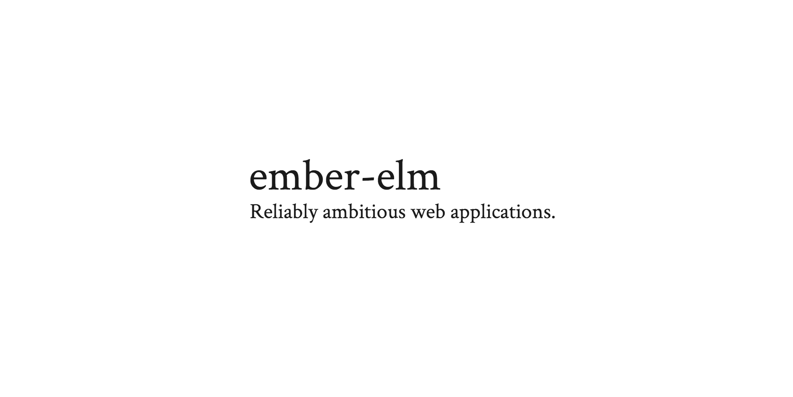
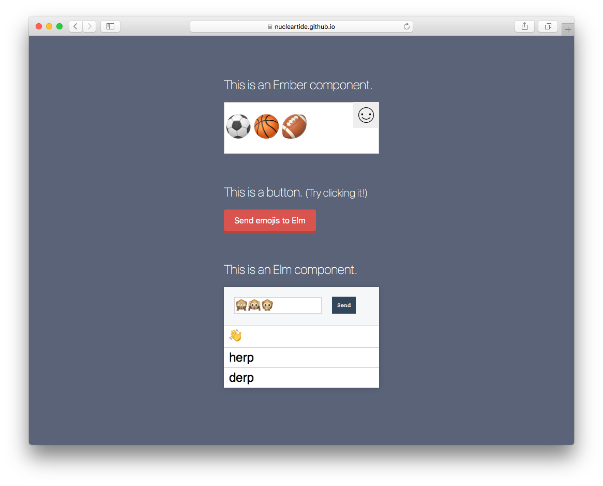

[](https://emberobserver.com/addons/ember-elm)

ember-elm lets you write Ember components in [Elm](http://elm-lang.org/)! It
integrates cleanly with your existing Ember application, so you can experiment
with Elm without having to migrate to another front-end stack. It also
integrates with ember-cli, so you can develop Elm code with live reloading,
while having access to the full power of ember-cli's addon ecosystem.

## Demo

<a href="https://nucleartide.github.io/ember-elm/"></a>

## Features

- Use your Elm code in Ember with `elm-component`
- Generate Elm modules with `ember g elm-module`
- Live reload with ember-cli
- Leverage the power of the ember-cli and Elm ecosystems together in one stack

## Setup

### Prerequisites

Before you can install ember-elm, you need to have two things installed:

1. **Node 6.0.0+ or up**. This is because this addon's [build code](index.js) uses
   ES6.
2. [**Elm**](https://guide.elm-lang.org/install.html). Don't worry, it's relatively
   pain-free! This will be automated in the future.

### Install

```
$ ember install ember-elm
```

Alternatively, if you're using Yarn:

```
$ yarn add ember-elm --dev && ember g ember-elm
```

## Use

### Generate

To get started, let's get a simple "Hello World" example up and running.

First, generate an Elm module:

```
$ ember g elm-module hello
```

This will generate an Elm file in your project, located at
`app/elm-modules/Hello.elm`. You will see that a very basic Elm program has
already been written for you:

```elm
module Hello exposing (..)

import Html exposing (text)

main =
  text "hello world"
```

Take note of the `module Hello exposing (..)` declaration at the top of
`Hello.elm`. Like an ES6 file, every Elm file defines its own module. This
particular module will simply output a `<div>` containing the text "hello world"
to the screen.

### Componentize

Great! Your project now contains an Elm module. To actually use that module,
include the file `<your-app>/elm-modules.js` into a controller/component, so
that you can use your Elm module in a template.

> _Note:_
>
> [Behind the scenes](broccoli-elm/index.js), ember-elm finds all Elm files in
> your app tree, and compiles all of them into a single `elm-modules.js` file at
> the root of your tree. So you can't import an Elm file directly – you have to
> import `elm-modules.js`, and access properties on the imported object to get
> the module you want.

For example:

```js
// routes/application.js
import Ember from 'ember'
import Elm from 'my-app/elm-modules'

export default Ember.Route.extend({
  setupController(controller, model) {
    controller.set('Elm', Elm)
  }
})
```

```hbs
{{!-- templates/application.hbs --}}
{{elm-component src=Elm.Hello}}
```

Once that's done, you should see a simple "hello world" output to the screen:

> _Output:_
>
> <a href="assets/example_full.png"></a>

Congrats! If you've made it this far, you are now up and running with Elm.

## API

### `{{elm-component src=<Object> flags=<*> setup=<Function>}}`

Pass in an Elm module to use it:

```hbs
{{elm-component src=Elm.Hello}}
```

If the Elm module requires [flags][3], pass them in and they will be passed to
the Elm module:

```hbs
{{elm-component src=Elm.HelloWithFlags flags=(hash name='Dog')}}
```

To communicate with your Elm module, grab the functions that are passed via
[ports][2]:

```hbs
{{elm-component src=Elm.Chat setup=(action 'setupPorts')}}
```

```js
import Ember from 'ember'

export default Ember.Controller.extend({
  sendToElm(emojis) {},

  actions: {
    setupPorts(ports) {
      this.set('sendToElm', ports.emoji.send)
    },

    winkyFace() {
      this.get('sendToElm')(';)')
    }
  }
})
```

## Notes

### main

Compilation of Elm files in version 0.19.1 requires a `main` value for all files
passed to `elm-make`.

```
-- NO MAIN ---------------------------------------------------------------------

When producing a JS file, I require that given files all have `main` values.
That way functions like Elm.CSS.ChatConversationStyle.init() are definitely
defined in the resulting file. I am missing `main` values in:

... cut for brevity ...
```

To target only files that have `main` values, use the ember-elm `includePaths`
configuration option in `ember-cli-build.js` to limited compliation to only
safe directories.  The elm compiler will handle including any other module
dependencies.

```js
elm: {
  includePaths: ['app/elm-modules/Main']
}
```

### elm-stuff

ember-elm (via [node-elm-compiler][4]) will install Elm dependencies to
`elm-stuff/`.  To avoid committing Elm deps to version control, run:

```
$ echo elm-stuff/ >> .gitignore
```

### Babel

Babel will start stripping whitespace from `elm-modules.js` when it exceeds
100KB. This makes it harder to learn how it works. To disable this behavior, set
the Babel `compact` option to false in your `ember-cli-build.js`:

```js
module.exports = function(defaults) {
  const app = new EmberApp(defaults, {
    babel: {
      compact: false
    }
  })
}
```

## Badges


---

> Jason Tu &nbsp;&middot;&nbsp;
> Tide Software &nbsp;&middot;&nbsp;
> GitHub [@nucleartide](https://github.com/nucleartide) &nbsp;&middot;&nbsp;
> Twitter [@nucleartide](https://twitter.com/nucleartide) &nbsp;&middot;&nbsp;
> Slack [@nucleartide](https://embercommunity.slack.com/messages/@nucleartide/)

[1]: https://github.com/nucleartide/ember-elm/blob/7072c421333c072685b04f7a40d5d580d2cc2e92/tests/dummy/app/routes/application.js#L20
[2]: https://guide.elm-lang.org/interop/javascript.html#ports
[3]: https://guide.elm-lang.org/interop/javascript.html#flags
[4]: https://github.com/rtfeldman/node-elm-compiler
