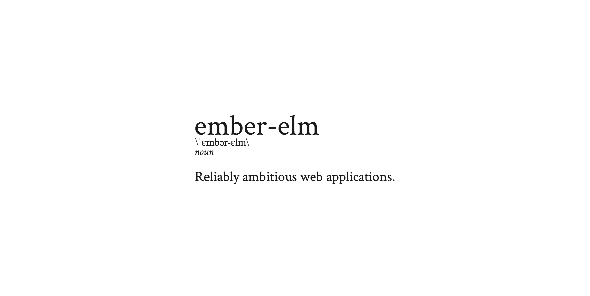

ember-elm lets you write Ember components in [Elm](http://elm-lang.org/)! It
integrates cleanly with your existing Ember application, so you can experiment
without having to migrate to another front-end stack. It also integrates with
ember-cli, so you can develop Elm code with the full power of ember-cli's live
reloading and addon ecosystem.

## Prerequisites

1. This addon uses ES6 for its [build code](index.js), so you will need Node
   6.0.0 or up.
2. [Install Elm](https://guide.elm-lang.org/install.html). (Don't worry, it's
   relatively pain-free! This will be automated in the future.)

## Install

```
ember install ember-elm
```

Alternatively, if you're using Yarn,

```
yarn add ember-elm --dev && ember g ember-elm
```

## Installation

* `git clone <repository-url>` this repository
* `cd ember-elm`
* `npm install`
* `bower install`

## Running

* `ember serve`
* Visit your app at [http://localhost:4200](http://localhost:4200).

## Running Tests

* `npm test` (Runs `ember try:each` to test your addon against multiple Ember versions)
* `ember test`
* `ember test --server`

## Building

* `ember build`

For more information on using ember-cli, visit [https://ember-cli.com/](https://ember-cli.com/).

---

.gitignore elm-stuff
babel compact false
